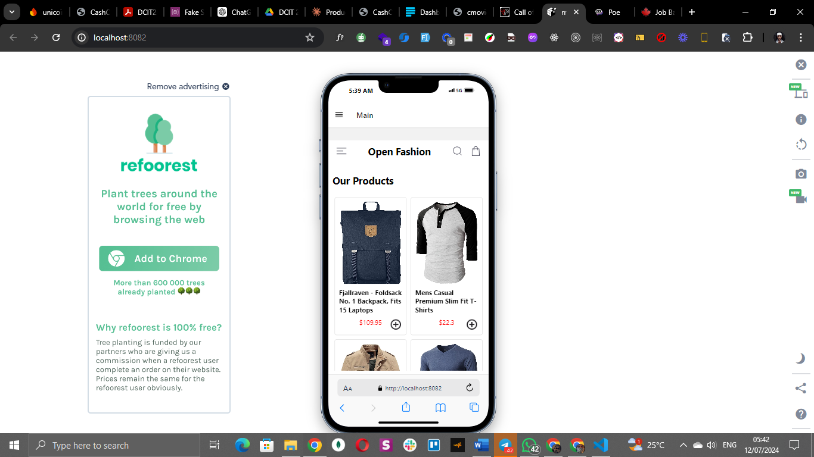
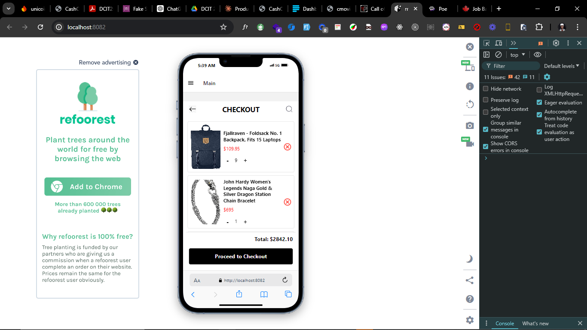
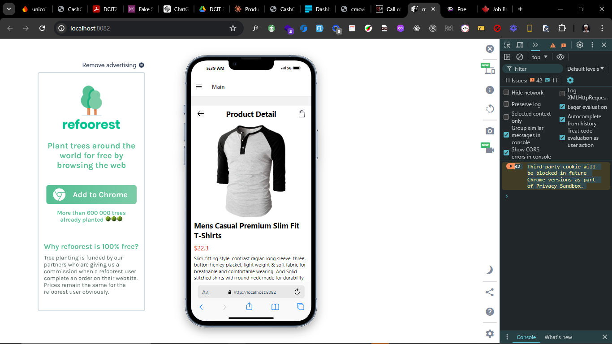

# student id: 11352458

# rn-assignment6-11352458

## React Native Ecommerce App

This project is a React Native application that implements a simple ecommerce interface with features such as viewing products, adding them to a cart, removing items from the cart, and storing cart items locally using AsyncStorage.

## Usage

View Products: Navigate to the HomeScreen to see available products.
Add to Cart: Tap the "Add to Cart" button on a product to add it to your cart.
Remove from Cart: Go to the CartScreen and tap the "Remove" button next to an item to remove it from your cart.

## Features

HomeScreen: Displays available products with an option to add each product to the cart.
CartScreen: Shows selected items in the cart with the ability to remove items.
Local Storage: Uses AsyncStorage to persist selected items locally on the device.

### Screenshots

